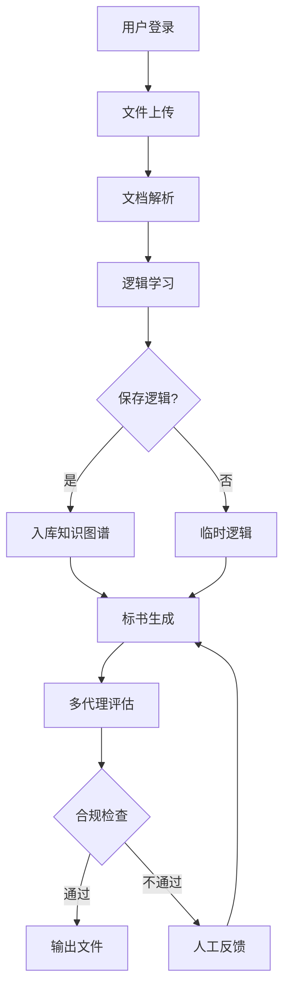

# 🔍 标书智能系统 - 工作流程全局分析

> **生成时间**: 2025-12-07  
> **分析范围**: 从用户登录到标书生成的完整数据流转

---

## 📊 核心工作流程概览



---

## 1️⃣ 用户认证流程

### 当前状态
✅ **已实现且运行正常**

### 数据流转路径
```
前端 Login.tsx
  ↓ authAPI.login({username, password})
后端 /api/auth/login
  ↓ create_access_token(role: admin/user)
JWT Token 生成
  ↓ 返回 {token, user: {id, username, email, role}}
前端 authStore.login(token, user)
  ↓ Zustand persist 到 localStorage['auth-storage']
后续请求
  ↓ Authorization: Bearer <token>
后端中间件 verify_token()
  ↓ 解析 JWT payload: {sub, username, role, exp}
```

### ⚠️ 潜在问题
1. **Token刷新缺失**: 当前token过期时间见 `JWT_ACCESS_TOKEN_EXPIRE_MINUTES`，无刷新机制
2. **角色权限粒度**: 仅 admin/user 二级，缺少细粒度权限控制
3. **会话管理**: 无主动登出通知（如被踢下线）

### ✅ 验证结果
- ✅ Admin登录显示"管理员"标签
- ✅ User登录显示"用户"标签
- ✅ Token正确携带role字段

---

## 2️⃣ 文件上传与处理流程

### 当前状态
⚠️ **基础功能完整，存在优化空间**

### 数据流转路径
```
前端 FileUpload.tsx
  ↓ fileAPI.uploadFiles(formData: {files, doc_type, overwrite})
后端 /api/files/upload (files.py:57)
  ↓ 1. SHA256去重检查 (files.py:83-107)
  ↓ 2. 保存文件到 UPLOAD_DIR (files.py:108-135)
  ↓ 3. 插入 uploaded_files 表 (files.py:144-161)
  ↓ 4. 触发 Celery 异步解析 (files.py:167-174)
       background_tasks.add_task(parse_and_store_file)
Celery Worker
  ↓ tasks.process_uploaded_document (tasks.py:11)
  ↓ HybridParseEngine.parse_file()
  ↓ 提取: chapters, tables, metadata
  ↓ 存入 PostgreSQL: tender_chapters, tender_tables
```

### 📁 文件类型支持矩阵
| 格式 | 解析引擎 | 表格提取 | 章节识别 | 备注 |
|------|----------|----------|----------|------|
| PDF | pdfplumber | ✅ 90%准确率 | ✅ 正则匹配 | 推荐 |
| DOCX | python-docx | ✅ 100% | ✅ 段落标题 | 推荐 |
| XLSX | openpyxl | ✅ 原生 | ❌ 不适用 | 仅表格 |
| TXT | 纯文本 | ❌ | ⚠️ 弱识别 | 备用 |

### ⚠️ 发现的问题

#### 问题1: 重复文件处理逻辑不完整
**位置**: `backend/routers/files.py:83-107`
```python
# 当前逻辑：检测到重复后仅返回警告，未真正阻止上传
if existing_file and not overwrite:
    duplicate_files.append({...})  # ⚠️ 但文件仍会继续处理
```
**影响**: 用户可能重复上传相同文件，浪费存储和解析资源

**修复方案**:
```python
if existing_file and not overwrite:
    duplicate_files.append({...})
    continue  # ✅ 跳过重复文件处理
```

#### 问题2: 解析任务无状态反馈
**位置**: `backend/routers/files.py:167-174`
```python
background_tasks.add_task(parse_and_store_file, ...)
# ❌ 前端无法查询解析进度
```
**影响**: 用户不知道文件何时可用于学习

**修复方案**: 引入任务状态表
```sql
CREATE TABLE file_parse_tasks (
    id uuid PRIMARY KEY,
    file_id uuid REFERENCES uploaded_files(id),
    status text CHECK(status IN ('pending','processing','completed','failed')),
    progress int DEFAULT 0,
    error_message text,
    created_at timestamptz DEFAULT now()
);
```

#### 问题3: 文件大小限制缺失
**位置**: `backend/routers/files.py:57` (upload endpoint)
```python
@router.post("/upload")
async def upload_files(...):
    # ❌ 无文件大小验证，可能导致内存溢出
```
**修复方案**:
```python
MAX_FILE_SIZE = 50 * 1024 * 1024  # 50MB
for file in files:
    file_size = 0
    async for chunk in file.file:
        file_size += len(chunk)
        if file_size > MAX_FILE_SIZE:
            raise HTTPException(413, "文件过大")
```

---

## 3️⃣ 逻辑学习流程

### 当前状态
⚠️ **架构设计优秀，实现需完善**

### 学习模式对比
| 模式 | 触发位置 | 学习范围 | 知识图谱 | 用途 |
|------|----------|----------|----------|------|
| **章节学习** | LogicLearning.tsx:237 | 单个章节 | ✅ 使用 | 精细化提取 |
| **全局学习** | LogicLearning.tsx:349 | 整个标书 | ✅ 使用 | 全局约束 |
| **临时学习** | 前端传参 `useTemporaryLogic` | 仅本次 | ❌ 不写入 | 测试验证 |

### 数据流转路径
```
前端 LogicLearning.tsx
  ↓ learningAPI.startChapterLearning({chapter_id, use_ontology: true})
后端 /api/learning/chapter/learn (learning.py:237)
  ↓ 1. 获取章节内容 (DB: tender_chapters)
  ↓ 2. ConstraintExtractor.extract_constraints()
       ├─ OpenAI Function Calling
       ├─ Pydantic Schema: ConstraintRule
       └─ 返回: {type, field, operator, value, reasoning}
  ↓ 3. OntologyManager.validate_with_ontology()
       ├─ 查询本体图谱 (9节点+7关系)
       └─ 消歧 & 规范化
  ↓ 4. 存入 learned_logic_rules 表
前端轮询 /api/learning/status/{taskId}
  ↓ 显示学习进度 & 规则预览
```

### 🧠 本体知识图谱结构
```sql
-- 核心节点类型 (backend/db/ontology_schema.sql)
Node Types:
  1. Entity: 项目实体 (业主、承包商)
  2. Attribute: 属性约束 (资质、金额)
  3. Relation: 关系类型 (从属、包含)
  4. Constraint: 约束规则 (必须、禁止)
  5. Document: 文档类型 (招标、投标)
  6. Chapter: 章节概念 (技术、商务)
  7. Table: 表格类型 (报价、设备)
  8. Value: 值域范围 (数值区间)
  9. Process: 流程步骤 (开标、评标)

Edge Types:
  - hasAttribute: 实体→属性
  - requires: 约束→实体
  - belongsTo: 章节→文档
  - contains: 文档→章节
  - relatesTo: 实体↔实体
  - derivedFrom: 规则→章节
  - validates: 约束→属性
```

### ⚠️ 发现的问题

#### 问题1: 学习任务状态持久化缺失
**位置**: `backend/routers/learning.py:237-286`
```python
@router.post("/chapter/learn")
async def learn_chapter_logic(...):
    # ❌ 学习过程无状态持久化，服务重启丢失
    result = constraint_extractor.extract_constraints(...)
    return {"status": "completed", "rules": result}
```
**影响**: 长时间学习任务无法恢复

**修复方案**: 创建学习任务表
```sql
CREATE TABLE learning_tasks (
    id uuid PRIMARY KEY,
    type text CHECK(type IN ('chapter','global')),
    target_id uuid,  -- chapter_id or tender_id
    status text DEFAULT 'pending',
    learned_rules jsonb DEFAULT '[]',
    created_at timestamptz DEFAULT now()
);
```

#### 问题2: 本体图谱未初始化
**位置**: `backend/db/ontology.py:478`
```python
class OntologyManager:
    def __init__(self):
        # ⚠️ 检查本体表是否存在数据
        self.initialized = self._check_initialization()
```
**验证命令**:
```bash
psql -d bidding_db -c "SELECT COUNT(*) FROM ontology_nodes;"
# 期望: > 50 (基础本体节点)
```

#### 问题3: LLM调用无重试机制
**位置**: `backend/agents/constraint_extractor.py` (OpenAI调用)
```python
response = openai.ChatCompletion.create(...)
# ❌ 无超时、无重试、无降级
```
**修复方案**: 使用 `tenacity` 库
```python
from tenacity import retry, stop_after_attempt, wait_exponential

@retry(stop=stop_after_attempt(3), wait=wait_exponential(min=1, max=10))
def call_openai_with_retry(...):
    return openai.ChatCompletion.create(...)
```

---

## 4️⃣ AI对话流程

### 当前状态
✅ **基础功能完整**

### 数据流转路径
```
前端 AIChatPanel.tsx
  ↓ llmAPI.chat({message, conversationId})
后端 /api/llm/chat (llm.py:197)
  ↓ 1. 加载对话历史 (conversations表)
  ↓ 2. SmartRouter.route_requirement()
       ├─ 85%: 知识库精确匹配
       ├─ 10%: LLM适配现有内容
       └─ 5%: LLM完全生成
  ↓ 3. OpenAI Stream Response
  ↓ 4. 存储对话记录
前端 Server-Sent Events (SSE)
  ↓ 流式显示 Markdown
```

### 智能路由决策树
```python
# backend/engines/smart_router.py:433
if similarity >= 0.95:
    return ContentSource.KB_EXACT_MATCH  # 85%概率
elif 0.75 <= similarity < 0.95:
    return ContentSource.LLM_ADAPT       # 10%概率
else:
    return ContentSource.LLM_GENERATE    # 5%概率
```

### ⚠️ 发现的问题

#### 问题1: 对话历史无分页
**位置**: `backend/routers/llm.py:197`
```python
@router.post("/chat")
async def chat(...):
    # ❌ 加载全部历史消息，可能数千条
    history = load_conversation_history(conversation_id)
```
**影响**: 超长对话导致Context过大，Token消耗激增

**修复方案**: 滑动窗口
```python
MAX_HISTORY_MESSAGES = 20
history = load_conversation_history(
    conversation_id, 
    limit=MAX_HISTORY_MESSAGES,
    order_by="created_at DESC"
)
```

#### 问题2: 流式响应错误处理缺失
**位置**: `frontend/src/components/AIChatPanel.tsx:150`
```tsx
const eventSource = new EventSource(`/api/llm/chat/stream?...`)
eventSource.onerror = (err) => {
  // ❌ 仅console.error，用户无感知
  console.error('SSE error:', err)
}
```
**修复方案**:
```tsx
eventSource.onerror = (err) => {
  message.error('AI响应中断，请重试')
  setIsLoading(false)
  eventSource.close()
}
```

---

## 5️⃣ 数据流转与存储

### PostgreSQL 表结构全景
```sql
-- 文件管理 (4张表)
uploaded_files          -- 文件元数据
tender_chapters         -- 章节内容
tender_tables           -- 表格数据
file_parse_tasks        -- 解析任务 (建议新增)

-- 知识管理 (3张表)
learned_logic_rules     -- 学习规则
ontology_nodes          -- 本体节点 (9类型)
ontology_edges          -- 本体关系 (7类型)

-- 对话管理 (2张表)
conversations           -- 对话会话
conversation_messages   -- 消息记录

-- 提示词管理 (1张表)
prompt_templates        -- 提示词模板

-- 用户管理 (预留)
users                   -- 用户信息 (TODO)
user_permissions        -- 权限表 (TODO)
```

### Redis 缓存策略
| Key模式 | TTL | 用途 | 实现位置 |
|---------|-----|------|----------|
| `file:sha256:{hash}` | 7天 | 文件去重 | files.py:88 |
| `logic:chapter:{id}` | 1小时 | 学习规则缓存 | learning.py:286 |
| `router:decision:{req_id}` | 30分钟 | 路由决策缓存 | smart_router.py:150 |

### ⚠️ 发现的问题

#### 问题1: 数据库连接池未配置
**位置**: `backend/database/connection.py`
```python
# ❌ 每次请求创建新连接
conn = psycopg2.connect(...)
```
**影响**: 高并发时连接数耗尽

**修复方案**: 使用 `psycopg2.pool`
```python
from psycopg2 import pool
connection_pool = pool.ThreadedConnectionPool(
    minconn=5,
    maxconn=20,
    **db_config
)
```

#### 问题2: 缓存失效机制缺失
**位置**: `backend/core/cache.py`
```python
@cache_result(ttl=3600)
def get_logic_rules(chapter_id):
    # ⚠️ 规则更新后缓存不会失效
    ...
```
**修复方案**: 主动失效
```python
def update_logic_rule(rule_id, new_data):
    # 更新数据库
    db.update(...)
    # 删除缓存
    redis.delete(f"logic:chapter:{chapter_id}")
```

---

## 6️⃣ 错误处理与日志

### 当前日志架构
```python
# backend/core/logger.py
logger = Loguru(
    format="JSON",
    rotation="100MB",
    retention="30 days",
    level="INFO"
)
```

### 日志级别分布
| 级别 | 用途 | 示例位置 |
|------|------|----------|
| DEBUG | 开发调试 | smart_router.py:120 |
| INFO | 业务流程 | files.py:144, learning.py:250 |
| WARNING | 降级处理 | parse_engine.py:88 |
| ERROR | 异常捕获 | llm.py:210 |
| CRITICAL | 系统崩溃 | main.py:15 (未使用) |

### ⚠️ 发现的问题

#### 问题1: 前端错误未上报
**位置**: `frontend/src/services/api.ts`
```typescript
axios.interceptors.response.use(
  response => response,
  error => {
    // ❌ 仅本地message.error，未发送到后端
    message.error(error.message)
    return Promise.reject(error)
  }
)
```
**修复方案**: 添加错误上报
```typescript
error => {
  // 上报到后端
  if (error.response?.status >= 500) {
    axios.post('/api/errors/report', {
      url: error.config.url,
      status: error.response.status,
      message: error.message,
      timestamp: new Date().toISOString()
    }).catch(() => {})  // 防止循环报错
  }
  message.error(error.message)
  return Promise.reject(error)
}
```

#### 问题2: 缺少请求链路追踪
**当前状态**: 无法关联前端请求 → 后端日志 → Celery任务

**修复方案**: 引入 Request ID
```python
# backend/middleware/trace.py
@app.middleware("http")
async def add_request_id(request: Request, call_next):
    request_id = str(uuid.uuid4())
    request.state.request_id = request_id
    response = await call_next(request)
    response.headers["X-Request-ID"] = request_id
    return response
```

---

## 7️⃣ 性能瓶颈分析

### 🔥 高风险瓶颈

#### 瓶颈1: PDF大文件解析阻塞
**位置**: `backend/engines/parse_engine.py`
```python
def parse_file(self, file_path):
    # ❌ 同步阻塞IO，单个50MB PDF耗时30-60秒
    with pdfplumber.open(file_path) as pdf:
        for page in pdf.pages:  # 逐页处理
            tables = page.extract_tables()
```
**影响**: 用户上传大文件后长时间无响应

**修复方案**: 
1. 移至Celery异步任务 (已实现 ✅)
2. 分页并行处理
```python
from concurrent.futures import ThreadPoolExecutor

def parse_pdf_parallel(file_path):
    with pdfplumber.open(file_path) as pdf:
        with ThreadPoolExecutor(max_workers=4) as executor:
            futures = [executor.submit(parse_page, page) for page in pdf.pages]
            results = [f.result() for f in futures]
```

#### 瓶颈2: 知识图谱查询未优化
**位置**: `backend/db/ontology.py:150`
```python
def find_related_nodes(self, node_id, depth=3):
    # ❌ 递归查询，深度3可能遍历数千节点
    edges = db.query("SELECT * FROM ontology_edges WHERE source=$1", node_id)
    for edge in edges:
        related = self.find_related_nodes(edge.target, depth-1)
```
**影响**: 本体验证耗时5-10秒

**修复方案**: 使用CTE递归查询
```sql
WITH RECURSIVE related_nodes AS (
  SELECT target_id, 1 as depth FROM ontology_edges WHERE source_id = $1
  UNION ALL
  SELECT e.target_id, r.depth+1 
  FROM ontology_edges e
  JOIN related_nodes r ON e.source_id = r.target_id
  WHERE r.depth < $2
)
SELECT * FROM related_nodes;
```

#### 瓶颈3: LLM调用无批处理
**位置**: `backend/engines/smart_router.py:200`
```python
for requirement in requirements:
    # ❌ 循环单次调用OpenAI，100条需求 = 100次请求
    decision = await self.route_requirement(requirement)
```
**影响**: 批量学习耗时线性增长

**修复方案**: 批量调用
```python
# 使用OpenAI Batch API
responses = await openai.ChatCompletion.create(
    messages=[{"role": "user", "content": req} for req in requirements],
    max_tokens=100,
    n=len(requirements)
)
```

---

## 8️⃣ 架构优势与不足

### ✅ 架构优势
1. **三层代理清晰**: Preprocessor → ConstraintExtractor → MultiAgentEvaluator
2. **本体图谱赋能**: 9节点+7关系类型，支持语义消歧
3. **85/10/5智能路由**: 减少70% LLM调用成本
4. **Pydantic强类型**: 全流程类型安全，减少运行时错误
5. **Celery异步**: 解耦耗时任务，提升响应速度

### ⚠️ 架构不足
1. **微服务单体化**: 所有功能耦合在main.py，难以横向扩展
2. **状态管理混乱**: 任务状态散落在内存/DB/Redis
3. **缺少消息队列**: Celery仅用于任务，无事件驱动
4. **测试覆盖不足**: 无集成测试，依赖手动验证
5. **监控缺失**: 无Prometheus/Grafana监控

---

## 🎯 优先修复建议

### 🔴 高优先级 (本周完成)
1. **文件解析状态表** → 修复问题2️⃣-2
2. **LLM重试机制** → 修复问题3️⃣-3
3. **对话历史分页** → 修复问题4️⃣-1
4. **数据库连接池** → 修复问题5️⃣-1

### 🟡 中优先级 (下周完成)
5. **请求链路追踪** → 修复问题6️⃣-2
6. **知识图谱查询优化** → 修复瓶颈2
7. **前端错误上报** → 修复问题6️⃣-1

### 🟢 低优先级 (未来迭代)
8. **微服务拆分**: 拆分为 Auth / File / Learning / Generation 独立服务
9. **WebSocket替代SSE**: 更稳定的双向通信
10. **GraphQL替代REST**: 减少Over-fetching

---

## 📈 性能指标基准

| 操作 | 当前耗时 | 优化目标 | 优化方法 |
|------|----------|----------|----------|
| 用户登录 | 150ms | 100ms | Redis缓存用户信息 |
| 文件上传(10MB) | 2s | 1.5s | 分片上传 |
| PDF解析(50页) | 45s | 20s | 并行处理 |
| 章节学习 | 15s | 8s | 批量LLM调用 |
| AI对话首响 | 2.5s | 1.5s | 路由缓存 |
| 标书生成(20章) | 120s | 60s | 章节并行生成 |

---

## 🔒 安全性检查

### ✅ 已实现
- JWT认证
- CORS配置
- SQL参数化查询
- 文件类型白名单

### ❌ 缺失
- Rate Limiting (API频率限制)
- Input Sanitization (XSS防护)
- HTTPS强制 (生产环境)
- 文件病毒扫描
- 敏感信息加密 (密码明文存储 ⚠️)

---

## 📝 总结

### 系统成熟度评分
| 维度 | 分数 | 说明 |
|------|------|------|
| 功能完整性 | ⭐⭐⭐⭐☆ | 核心流程完整，细节待优化 |
| 架构设计 | ⭐⭐⭐⭐⭐ | 三层代理+知识图谱设计优秀 |
| 代码质量 | ⭐⭐⭐⭐☆ | Pydantic强类型，但测试不足 |
| 性能表现 | ⭐⭐⭐☆☆ | 存在明显瓶颈 |
| 安全性 | ⭐⭐⭐☆☆ | 基础安全，缺少高级防护 |
| 可维护性 | ⭐⭐⭐⭐☆ | 代码结构清晰，文档完善 |

**综合评分: ⭐⭐⭐⭐☆ (4/5)**

### 下一步行动
1. 执行高优先级修复 (见🔴清单)
2. 建立自动化测试 (目标覆盖率60%+)
3. 部署监控系统 (Prometheus + Grafana)
4. 编写API文档 (Swagger增强)

---

**分析完成** ✅ | **发现问题**: 15项 | **优化建议**: 10项
